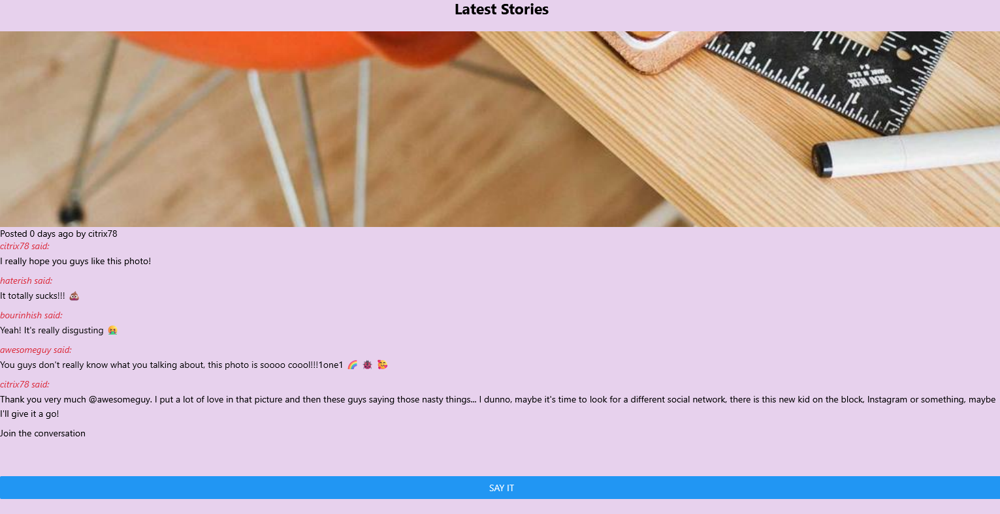

# Instapicapp

Instapicapp es una pequeña aplicación que se basa en Instagram, desarrollada con React Native


## Como ejecutar e iniciar la aplicación


```http
  npm install
```

```http
  npm start
```

Una vez iniciada la aplicación ingresar el enlace de localhost que sale en la linea de comandos


## Capturas de la aplicación



